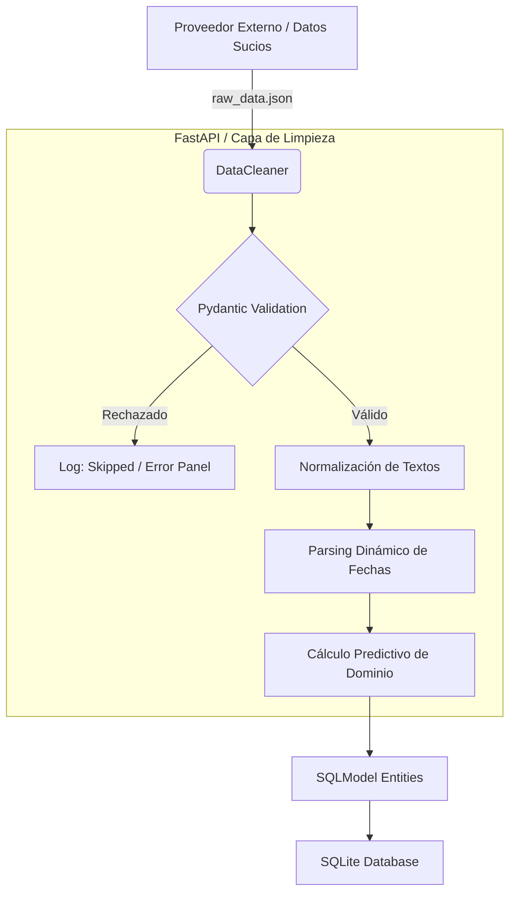

# Nexus MVP - Data Integration & Cleaning

Un Mínimo Producto Viable diseñado para "poner orden" en los flujos de datos de maquinaria pesada. Funciona como una capa intermedia que recibe datos sucios de fuentes externas, los valida, aplica reglas de negocio para limpiarlos y los persiste de manera relacional en un entorno seguro antes de ser procesados por un ERP o CRM.

## Tech Stack


* **Pydantic**: Responsable del parsing y validación estricta de estructura.
* **SQLModel**: ORM nativo gestionando los metadatos SQL y los objetos de dominio de manera conjunta.
* **uv**: Administrador rápido de paquetes e integraciones.

## Key Features

* **Data Integrity Estricta**: Uso estricto dual entre `pydantic` (Validación de entrada en memoria) y `sqlmodel` (Consistencia y relaciones SQLite persistentes), asegurando que ningún dato dañado alcance el repositorio final.
* **Limpieza Inteligente (Fallback Logging)**: Procesa campos erráticos (e.g. fechas con distintos formatos, horas irregulares) e intuye componentes vitales ausentes (e.g. Asignando 'Excavadora' cuando el modelo dictamina poseer el patrón "3CX").
* **Experiencia de Usuario de Terminal (CLI UX)**: El sistema incluye un orquestador altamente interactivo en consola con animaciones en tiempo real de estilo Live-Status, barras de progreso y reporte de errores visual apoyado en la librería `rich`.
* **Microservicio REST API (FastAPI)**: Integra un backend robusto capaz de ingerir lotes sucios (`POST /api/sync`) aplicando ETL en tiempo real y exponiendo directorios de maquinaria, empresas y alquileres (`GET /api/machinery`, `GET /api/companies`, etc.) con interfaces nativas Swagger.

## Instalación y Ejecución

Al estar estructurado como un proyecto `uv`, la puesta en marcha está automatizada:

1. Clona el repositorio y asegúrate de tener `uv` instalado.
2. Ejecuta el generador de pruebas primero para construir el escenario "Sucio":
   ```bash
   uv run python scripts/generate_raw_data.py
   ```
3. Ejecuta el Orquestador Local (ETL) que activará las transformaciones animadas en tu terminal:
   ```bash
   uv run python run_etl_local.py
   ```
4. **Despliegue de la API Web**: Activa el servidor web para interactuar con los endpoints mediante Swagger UI:
   ```bash
   uv run uvicorn src.api.main:app --reload
   ```
   Tras iniciar, entra en [http://127.0.0.1:8000/docs](http://127.0.0.1:8000/docs) para probar el entorno.
5. Navega visualmente por los resultados levantando el dashboard interactivo del MVP:
   ```bash
   uv run python src/cli_dashboard.py
   ```

## System Architecture & Workflow



